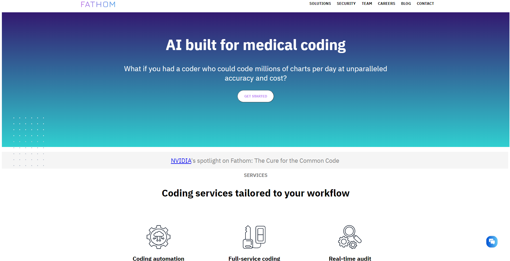
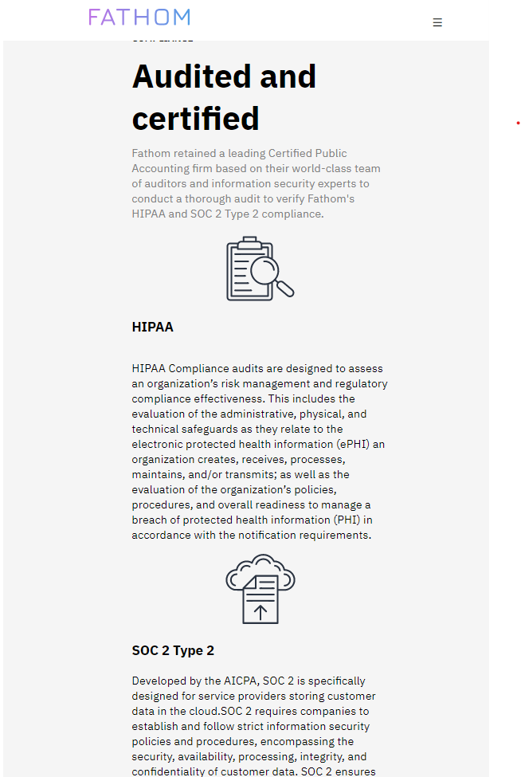
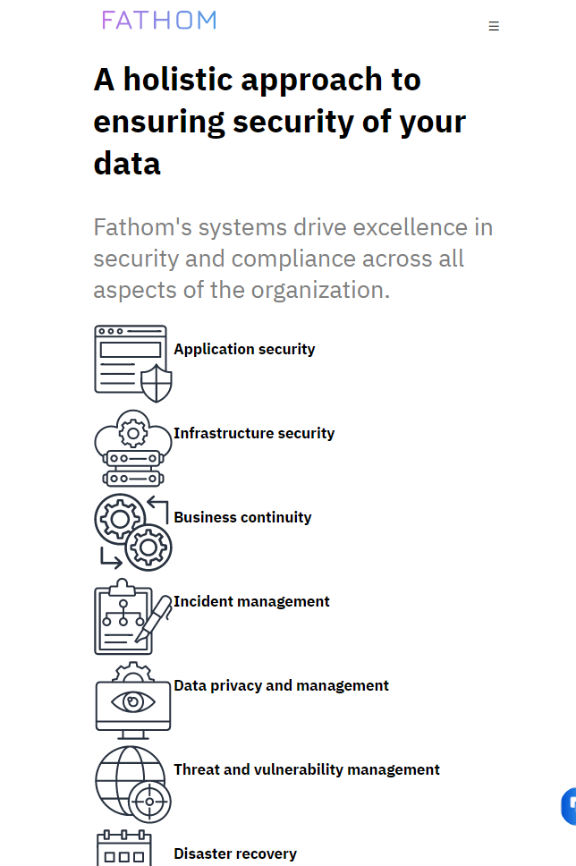
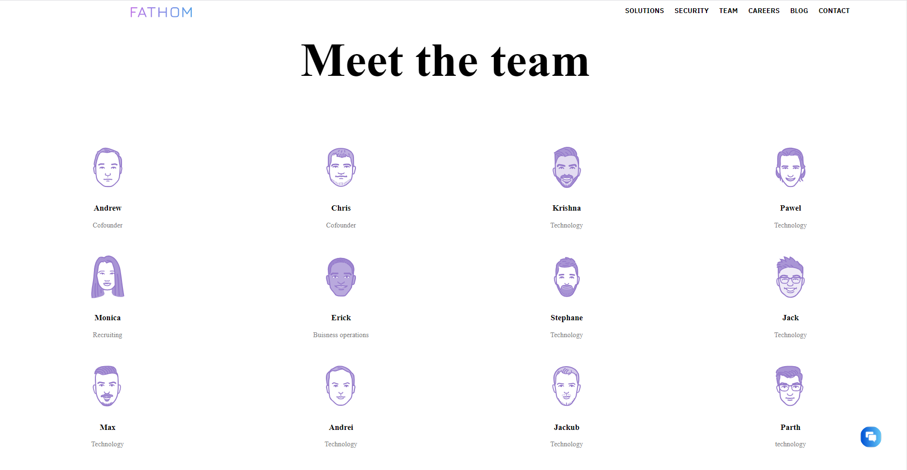

# **Clone of fathomhealth.com**   
Objective of this project is to make a website resembling the look and feel of the website fathomhealt.com with very limited use of tech stack (only below mentioned technologies are used).

## **Contributors:**  
---
- Sahil Raj
- Pushpal Chakrabarty
- Rizwan Ansari

## **Tech Stack Used:**
---
- **HTML 5**
- **CSS 3**
- **Javascript**

## **Landing Page**
---
- Replica of all the elements in the page including the sticky navigation bar at top and chat bot icon at the bottom.
- Snapshot of the website landing page:

## **Security Page**
---
- We also tried to reproduce the responsiveness of the pages. 
-screenshot of security page for mobile view:

 

## **Teams Page**
---
 

### **Reach Us:**
---

👤 Sahil Raj

- Github: https://github.com/sahil2019
- LinkdIn: https://www.linkedin.com/in/sahil-raj-5123b7162
- Email: sahil2011.raj@gmail.com

👤 Rizwan Ansari

- Github: https://github.com/ansari090
- LinkdIn: https://www.linkedin.com/in/rizwan-ansari-2401a3108/
- Email: ansaririzwan296@gmail.com
- twitter: @Rizwan_ansari9

👤 Pushpal Chakrabarty

- Github: https://github.com/pushpal99
- LinkdIn: https://www.linkedin.com/in/pushpal-chakrabarty-14645179/
- Email: pushpalchakrabarty99@gmail.com
- twitter: @pushpalchaks
